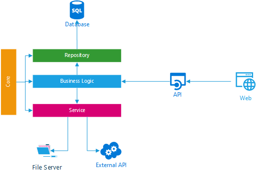
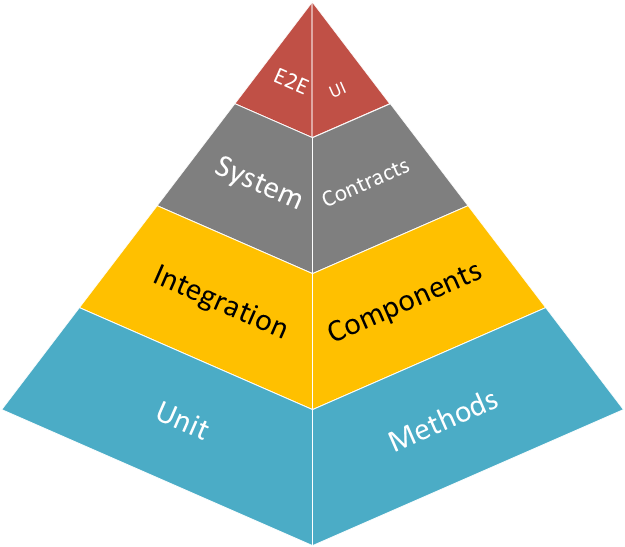
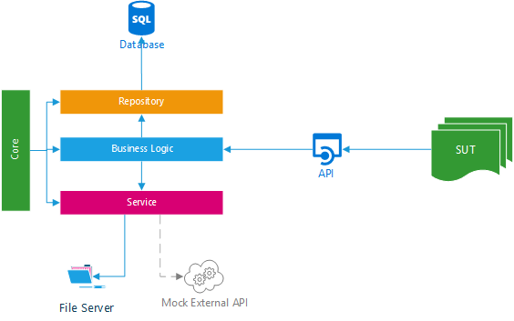

# TestEssentials. ToolKit

TestEssentials. ToolKit are set of libraries for testing all the integrated components which includes Sql Server database, API and UI for . Net Stack.

## Features

* Complete Application Layers Testing.
* Test SQL Server Database which includes Stored Procedures
* Test Identity Authenticate
* WireMock to Mock external api's.
* Workflow or Prioritize XUnit Facts (Test Cases)

## Common Application Architecture

Any application would consist of database, a backend api and fancy UI and with good architecture backend can be further broken into layered architecture. Some cases application consume external apis, perform i/o operation on file server, etc.



## Why do we need testing

An application(s) would always have logic spread across the layers due to architectural reasons or for better performance which makes it more difficult to test using Unit testing. Due to which QA's have to manually do the testing every time a new build is given or write automation tests that work for certain days or these test cases create unnecessary noise.

### Test Pyramid

For smoother development, testing & release of an application(s) test pyramid would give better advantage, For more information, please refer [Martin Flowers](https://martinfowler.com/articles/practical-test-pyramid.html
) article.



## What all we can be tested

* Unit Testing
* Integration Testing
* System Testing
* E2E Testing

## How TestEssentials will help

* Integration Testing
    1. Publish/Create brand new database with all schema & stored procedure.
    2. Using [ASP.Net Core TestServer](https://docs.microsoft.com/en-us/aspnet/core/test/integration-tests?view=aspnetcore-2.2).
    3. Using [WireMock.Net](https://github.com/WireMock-Net/WireMock.Net) to Mock external dependencies.

    



* E2E Testing
    1. Publish/Create brand new database with all schema & stored procedure.
    2. Running ASP.Net Core on Krestal Server
    3. Using [WireMock.Net](https://github.com/WireMock-Net/WireMock.Net) to Mock external dependencies.

    


For Implemantation details refer.

### Advantages

* Test Suite Execution would be Consistent.
* Test Suite can run without actually deploying on server.
* Continuously Improve Quality of Code by refactoring.
* Development & Testing can go hand on hand.
* Incorporate Continuous Integration / Continuous Deployment Pipeline.
* Develop Automation Test Suit.
* Reduce Regression Cycle.

#### Using TestDatabase

```c#
ITestDatabase _database = new DacpacTestDatabase("<!-- Connection String -->")

                .ConfigureOptions(option =>
                {
                    option.DacpacPath = Path.GetFullPath(
                                        @"<!-- Dacpac Path -->");
#if DEBUG
                    option.AlwayCreate = false;
                    option.AlwayDrop = false;
#else
                    option.AlwayCreate = false;
                    option.AlwayDrop = true;
#endif
                })
                .Build()
                .RunScriptFile(@"seed-data.sql");

```

For more details refer: [Using TestDatabase](https://github.com/muzammilkm/test-essentials/wiki/Using-TestDatabase)

#### Using TestAuthentication

```c#
public void ConfigureServices(IServiceCollection services)
{
    services
        .AddAuthentication(options =>
        {
            options.DefaultAuthenticateScheme = "Test Scheme";
            options.DefaultChallengeScheme = "Test Scheme";
        })
        .AddTestServerAuthentication();
}
```

For more details refer: [Using TestAuthentication](https://github.com/muzammilkm/test-essentials/wiki/Using-TestAuthentication)

#### Using HttpMockServer

```c#
var ttpMockServer = new HttpMockServer(
                Path.GetFullPath("Scripts"),
                36987);
httpMockServer.Start();
```

For more details refer: [Using HttpMockServer](https://github.com/muzammilkm/test-essentials/wiki/Using-HttpMockServer)

#### Using TestServer

```c#
var builder = new WebHostBuilder()
                .UseStartup<TestStartup>();

var server = new TestServer(builder);
```

For more details refer: [Using TestServer](https://github.com/muzammilkm/test-essentials/wiki/Using-TestServer)

